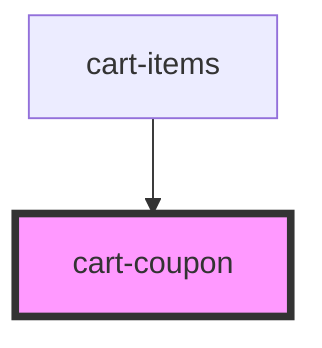

# cart-coupon

<!-- Auto Generated Below -->

## Properties

| Property         | Attribute         | Description                                       | Type     | Default     |
| ---------------- | ----------------- | ------------------------------------------------- | -------- | ----------- |
| `appliedCoupon`  | `applied-coupon`  | Currently applied coupon code (if any)            | `string` | `undefined` |
| `discountAmount` | `discount-amount` | Discount amount to display when coupon is applied | `number` | `undefined` |

## Events

| Event    | Description                            | Type                  |
| -------- | -------------------------------------- | --------------------- |
| `apply`  | Event emitted when a coupon is applied | `CustomEvent<string>` |
| `remove` | Event emitted when a coupon is removed | `CustomEvent<void>`   |

## Dependencies

### Used by

 - [cart-items](../cart-items)

### Graph

----------------------------------------------

*Built with [StencilJS](https://stenciljs.com/)*
