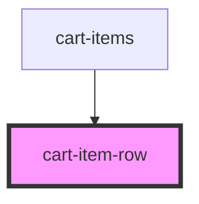

# cart-item-row

<!-- Auto Generated Below -->

## Properties

| Property | Attribute | Description                                   | Type       | Default     |
| -------- | --------- | --------------------------------------------- | ---------- | ----------- |
| `item`   | `item`    | Single cart item object to display in the row | `CartItem` | `undefined` |

## Dependencies

### Used by

 - [cart-items](../cart-items)

### Graph

----------------------------------------------

*Built with [StencilJS](https://stenciljs.com/)*
