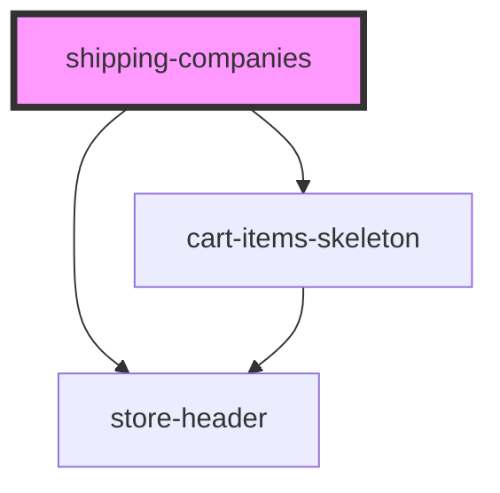

# shipping-companies

<!-- Auto Generated Below -->

## Overview

ShippingCompanies Component
Displays a list of shipping options and handles user selection and submission.

## Properties

| Property    | Attribute    | Description                   | Type     | Default     |
| ----------- | ------------ | ----------------------------- | -------- | ----------- |
| `cartTotal` | `cart-total` | Cart total passed from parent | `number` | `undefined` |

## Events

| Event                | Description                                 | Type                          |
| -------------------- | ------------------------------------------- | ----------------------------- |
| `backToCart`         | Emits event to navigate back to cart        | `CustomEvent<void>`           |
| `proceedToConfirmed` | Emits event to proceed to confirmation page | `CustomEvent<void>`           |
| `shippingSelected`   | Emits selected shipping option              | `CustomEvent<ShippingOption>` |

## Dependencies

### Depends on

- [cart-items-skeleton](../cart-items-skeleton)
- [store-header](../store-header)

### Graph

----------------------------------------------

*Built with [StencilJS](https://stenciljs.com/)*
