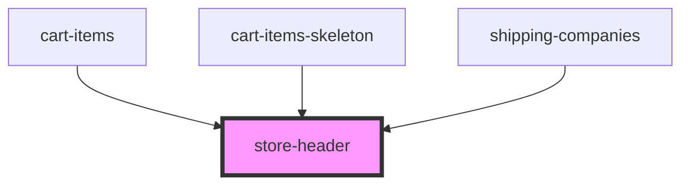

# store-header

<!-- Auto Generated Below -->

## Overview

StoreHeader Component
Reusable header for all checkout steps displaying the store name and navigation breadcrumb.

## Properties

| Property      | Attribute      | Description                                                           | Type     | Default       |
| ------------- | -------------- | --------------------------------------------------------------------- | -------- | ------------- |
| `currentStep` | `current-step` | Current step in the checkout process (e.g., cart, checkout, shipping) | `string` | `'checkout'`  |
| `storeName`   | `store-name`   | Name of the store to display                                          | `string` | `'StoreName'` |

## Dependencies

### Used by

 - [cart-items](../cart-items)
 - [cart-items-skeleton](../cart-items-skeleton)
 - [shipping-companies](../shipping-companies)

### Graph

----------------------------------------------

*Built with [StencilJS](https://stenciljs.com/)*
